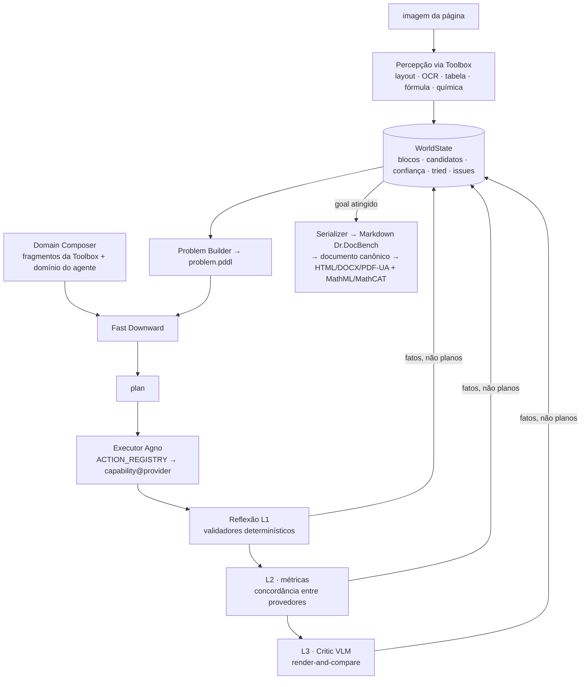
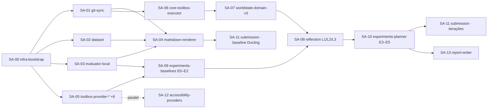

# Acessilia × Dr.DocBench — Plano de trabalho e orquestração por subagentes

> Documento de handoff para a máquina de execução (GPU). Contém: (1) o que é a
> tarefa, (2) a arquitetura-alvo (Core + Toolbox + Providers), (3) o que instalar
> na máquina, (4) as fases e experimentos, e (5) como o **orquestrador** deve
> criar e coordenar cada **subagente**. Branch de trabalho: `feat/drdocbench-toolbox`.
>
> Regras para qualquer agente: **não commitar nem fazer push sem OK explícito do
> Marcos; não abrir PR.** O commit/push deste checkpoint foi autorizado em
> 07/09/2026; isso não autoriza publicações futuras.

> **Checkpoint de 07/09/2026:** leia primeiro [status.md](status.md). Este plano
> descreve a arquitetura-alvo, não funcionalidades já entregues. Os dois merges
> foram concluídos; a implementação nova está sendo publicada como checkpoint
> parcial autorizado. DrDocBench/OmniDocBench podem usar clones oficiais. A prioridade
> agora é continuar na máquina GPU, não instalar modelos neste Mac.

---

## 0. Referências

| O que | Onde |
|---|---|
| Site do desafio | https://drdocbench-challenge.abaka-pages.com/ |
| Dataset (dev com GT + test só imagens) | https://huggingface.co/datasets/2077AIDataFoundation/DrDocBench |
| Código oficial de avaliação | https://github.com/2077AI/DrDocBench (estende https://github.com/opendatalab/OmniDocBench) |
| CDM (métrica de fórmulas) | https://github.com/opendatalab/UniMERNet/tree/main/cdm |
| Submissão | https://eval.ai/web/challenges/challenge-page/2717/overview |
| Paper do benchmark | arXiv 2606.01393 |
| Artigo indicado pelo prof (planning PDDL + agentes + validadores) | arXiv 2512.09629 — La Malfa et al., *End-to-end PDDL Planning with Hardcoded and Dynamic Agents* |
| Acessilia Toolbox (prof. Akira) | https://github.com/A11yDevs/acessilia-toolbox — ler `docs/architecture.md`, `docs/capability-model.md`, `docs/pddl.md`, `docs/api.md` |
| Integração Core↔Toolbox já iniciada | branch `upstream/feat/toolbox-integration` (`backend/tools/toolbox_client.py`, `toolbox_structurer.py`, `backend/core/manifest/toolbox_extractor.py`) |
| Estado atual do Core (PDDL) | `backend/agents/pddl_orchestrator.py`, `backend/core/planning/`, `backend/core/planning/domains/domain_v2.2.pddl`, `backend/core/manifest/`, `backend/tools/formula_tools.py` |

Leituras teóricas recomendadas (ordem): LLM+P → CRITIC → Reflexion → ReWOO →
DUPLEX → La Malfa et al. (2512.09629) → SPIRAL → DocAgent.

---

## 1. A tarefa do desafio

**Entrada:** imagem JPG de **uma** página (unidade de predição = 1 página; o paper
usa janela de 2, o desafio não).

**Saída:** um Markdown por página, seguindo o prompt unificado do benchmark:

| Conteúdo | Convenção obrigatória |
|---|---|
| Texto | idioma/escrita originais, sem tradução, sem "chutar" trechos ilegíveis |
| Multi-coluna | colunas na ordem natural de leitura (esq→dir, cima→baixo) |
| Fórmulas | LaTeX — `\( ... \)` inline, `\[ ... \]` display |
| Tabelas | HTML dentro de `<table>`, com `rowspan`/`colspan` |
| Química | `\ce{}` (mhchem) para reações; SMILES em bloco ```` ```smiles ```` |
| Código/pseudocódigo | bloco cercado com tag de linguagem |
| Partituras | ```` ```musicxml ```` (exploratório, **sem métrica** → fora do escopo) |
| Figuras | ignorar o visual; transcrever rótulos/eixos como texto |

**Submissão:** `submission.zip` → `predictions.jsonl` com campos
`subject, document_id, page, markdown` para **todas** as páginas de `test/`
(509). Validação estrita: faltante, extra, duplicado ou id inválido → rejeição.
Máx. **3 submissões/dia**; **2** escolhidas para avaliação final.
**Prazo: 10/10/2026 12:59 UTC.** Top-ranked entrega relatório técnico e
**declara todos** os dados/modelos/recursos externos usados.

**Métricas (por página, depois média):**

| Componente | Definição | Escala |
|---|---|---|
| Text | Normalized Levenshtein (NED) sobre blocos de texto | ↓ 0–1 → `(1−NED)×100` |
| Table | TEDS médio sobre tabelas válidas | ↑ 0–100 |
| Formula | CDM F1 sobre `equation_isolated` | ↑ 0–100 |
| Reading order | `(1 − NED da ordem)×100` | ↑ 0–100 |
| **Overall** | média dos componentes **disponíveis** na página (ausentes saem do denominador) | ↑ 0–100 |

**Dados:**
- `dev/<BISAC_SUBJECT>/<uuid>/{images/page_N.jpg, json/…_page_N.json, mds/…_N.md, <uuid>.md}` — 986 páginas (970 anotadas, 16 em branco = `[]`), 66 documentos, 38 assuntos, 12.902 blocos. GT em OmniDocJSON: `layout_dets[]` com `category_type` (20 tipos), `poly`, `order` (ausente em header/footer/page_number), `text`, `latex`, `html`, `attribute`; `extra.relation` (`parent_son`, `truncated`).
- `test/<SUBJECT>/<uuid>/images/page_N.jpg` — 509 páginas, 34 docs, 28 assuntos; disjunto de `dev` (documento, página, SHA, ISBN).
- Perfil do `dev`: livros 726, revistas 84, artigos 75, livro-texto colorido 70; `single_column` 494, `other_layout` 193, `double_column` 146; flags `colorful_backgroud` 157, `fuzzy_scan` 140, `table_full_line` 40, `table_fewer_line` 25, `table_horizontal` 18, `table_wireless_line` 15. Inglês.

**Estado da arte (benchmark completo, 4.514 págs):** GPT-5.5 **61.94**; Kimi-K2.5
60.38; Claude Opus 4.6 60.19; Gemini 3.1 Pro 60.13; Qwen3.5-Flash 57.51;
**MinerU 2.5 54.37 com o melhor TEDS (63.70)**; PaddleOCR 34.78.
**Leitura estratégica:** parsers de pipeline vencem em tabelas; VLMs vencem em
texto/ordem. Nenhum sistema passa de 62. Um planejador que **roteia por tipo de
bloco e replaneja quando um validador reprova** ataca exatamente essa
complementaridade — e isso é mensurável aqui. Essa é a hipótese científica.

---

## 2. Arquitetura-alvo

### 2.1 Fronteiras (conforme `acessilia-toolbox/docs/architecture.md`)

| Camada | Dono | Responsabilidades |
|---|---|---|
| **Agentic Core** (`acessilia`) | nós | objetivos, `WorldState`, `problem.pddl`, composição do `domain.pddl`, invocação do Fast Downward, plan-and-execute, reflexão (validadores + crítico), seleção **estratégica** de provedor, memória/pipelines, human-in-the-loop |
| **Toolbox** (`acessilia-toolbox`, porta 8002) | prof. Akira (contribuímos) | descoberta de capacidades, contratos normalizados, adapters, saúde/timeouts, artefatos por referência (SHA-256), cache, publicação de **fragmentos PDDL** (`/v1/planning/*`) |
| **Providers** | containers externos | docling-serve, MinerU, PaddleOCR, Surya, UniMERNet, vLLM (Qwen-VL), MolScribe, MathCAT, Pandoc/TeXLive, MinIO, Valkey… |

Contrato da Toolbox: `capabilities/<id>.yaml` (id, `input/output.schema`,
`media_types`, `execution.{deterministic,idempotent,cacheable}`,
`semantics.{requires,produces}`, `providers`) + `providers-config.yaml`
(endpoint, transporte, health) + adapter Python em
`src/acessilia_toolbox/providers/` registrado em `ADAPTERS`. Nome de provedor
**nunca** entra no id da capacidade.

### 2.2 Ciclo planejar → executar → revisar → replanejar



Mapeamento do algoritmo do prof (10 passos):

| Passo do prof | Onde vive |
|---|---|
| 1–2 imagem → estrutura canônica via ferramenta de extração | Toolbox `document.structure.extract` (+ capacidades por bloco) → `WorldState` |
| 3–5 EC → LaTeX → PDF → imagem de teste | Toolbox `document.render` (Pandoc/TeXLive **ou** Markdown→HTML→PNG via Chromium — mais fiel ao que é pontuado e menos lossy que LaTeX) |
| 6 VLM compara IE × IT → relatório de erros (RE) | Core: Critic L3 (Agno, saída estruturada) — **por bloco**, não por página |
| 7 RE → problem.pddl atualizado | Core: RE vira **fatos** (`rejected`, `complex-span`, `low-confidence`…) no `WorldState` → Problem Builder |
| 8 domain + problem → novo plano (planejador determinístico) | Core: Fast Downward (já em `pddl_processor.py`) |
| 9 revisar execução; manter/replanejar; memória de provedores tentados; desistir | Core: loop de `pddl_orchestrator.py` (`max_replans`, predicado `tried`, `escalate-human`) |
| 10 fornecer EC | Serializer (Markdown do desafio + documento canônico acessível) |

Princípios (conversas GPT + La Malfa et al.):
1. PDDL decide **o quê e em que ordem**; Agno executa, observa, avalia.
2. Ação PDDL → `ACTION_REGISTRY` determinístico → capability@provider. Nunca "LLM interpreta ação".
3. Separar `candidate-produced` de `validated`. Executar ≠ acertar.
4. Reflexão em 3 níveis, do barato ao caro: determinística → métricas/regras → Critic VLM.
5. O crítico produz **fatos** (predicados), nunca planos.
6. `:action-costs` → escalada por necessidade (Docling 1 … VLM 20 … humano 100). Custos iniciais uniformes, depois **aprendidos** da matriz de competência.
7. `WorldState` é a única fonte de verdade; `ProcessingManifest` vira projeção/artefato.
8. Feedback do solver/validador (sintaxe PDDL, VAL) corrige o modelo formal — "agentes hardcoded" do artigo.

### 2.3 Domínio PDDL v3 (evolução de `domain_v2.2.pddl`)

- **Objetos:** `page`, `block`; tipos de bloco `text | title | table | formula | figure | chem | code`.
- **Predicados:** `detected ?b`, `candidate ?b ?prov`, `validated ?b`,
  `rejected ?b ?prov`, `tried ?b ?prov` (mantido do v2.2),
  `low-confidence ?b`, `complex-span ?b`, `disagreement ?b`,
  `provider-available ?prov`, `serialized ?p`, `human-required ?b`.
- **Ações:** `parse-<tipo>` × provedor (geradas a partir dos fragmentos publicados
  em `/v1/planning/capabilities/{id}`, com custo), `validate-<tipo>` (L1/L2),
  `critique ?b` (L3, caro), `accept ?b`, `escalate-human ?b`, `serialize-page ?p`.
- **Meta:** todos os blocos `validated` (ou `human-required`) e página `serialized`.
- Compatibilidade: obrigações do v2.2 tornam-se metas por bloco; "métodos"
  tornam-se provedores. Reaproveitar `DomainBundle` (SHA-256), `pddl_processor`
  (validação + FD) e `comparison.py`.

### 2.4 Capacidades e provedores a acrescentar na Toolbox

| Capacidade (`capabilities/*.yaml`) | Provedores candidatos (verificar disponibilidade/licença) | Serve ao desafio | Serve à acessibilidade |
|---|---|---|---|
| `document.structure.extract` | docling-serve ✅ (GPU), **MinerU 2.5/3.x** (pipeline/VLM/híbrido), **PP-StructureV3 / PaddleOCR-VL**, Marker, Granite-Docling | baseline por página | backbone |
| `document.layout.detect` | Surya layout, PP-DocLayout, DocLayout-YOLO | 2ª opinião de blocos | — |
| `document.reading_order` | Surya order, LayoutReader | Reading Order | ordem de leitura acessível |
| `document.ocr` | PP-OCRv5, RapidOCR (já usado), Surya OCR, Tesseract | `fuzzy_scan` | — |
| `table.recognize` → HTML | MinerU (RapidTable/UniTable), SLANeXt (Paddle), TableFormer (docling), Surya table | **TEDS** | linearização |
| `table.validate` | parser HTML + grade de row/colspan (determinístico) | L1 | idem |
| `formula.recognize` → LaTeX | UniMERNet, PP-FormulaNet, CodeFormula (já usado), pix2tex, Nougat | **CDM** | entrada da cascata |
| `formula.latex.validate` | pylatexenc + render KaTeX/MathJax (Node) | L1 | idem |
| `formula.latex_to_mathml` | latex2mathml (já usado), LaTeXML, MathJax-node | — | MathML |
| `formula.mathml.speak` | **MathCAT** (confirmar locale pt-BR), Speech Rule Engine, `verbalize_latex_fallback` (nosso, pt-BR) | — | verbalização |
| `chemistry.recognize` | MolScribe (→SMILES), DECIMER, RxnScribe (reações) | `\ce{}` / ```smiles | descrição química |
| `vision.describe` / `vision.critique` | Qwen3-VL / Qwen2.5-VL (vLLM local), InternVL3; frontier via API **opcional** (exige disclosure) | Critic L3, fallback de texto | alt-text (já existe) |
| `document.render` | Pandoc + TeXLive (temos), WeasyPrint/Chromium headless | render-and-compare | PDF/UA |
| `accessibility.validate` | validadores existentes, veraPDF | — | conformidade |
| `music.omr` | Audiveris, oemer | **fora do escopo** (sem métrica) | — |

---

## 3. Máquina de execução

### 3.1 Por que não a máquina local
Mac com Apple A18 Pro, 8 GB RAM, 6 CPUs, cerca de 17 GiB livres no checkpoint,
sem CUDA. Isso impede validar o ambiente CUDA localmente, mas não significa
que todo parser seja incompatível com CPU/MPS. A decisão é transferir agora:
não baixar novos modelos nem recriar os ambientes de inferência neste Mac.

### 3.2 Requisitos mínimos e recomendados (Linux x86_64)

| Recurso | Mínimo | Recomendado | Observação |
|---|---|---|---|
| GPU | Referência inicial: 1× NVIDIA 24 GB | 1× 48–80 GB | Estimativa, não medição: executar provedores sequencialmente e escolher versões/modelos após medir VRAM. Não há garantia de que todo modelo listado caiba |
| CPU | 16 vCPU | 32 vCPU | OCR/TEDS/CDM são CPU-bound |
| RAM | 64 GB | 128 GB | docling-serve + MinerU + Paddle + vLLM + avaliador simultâneos |
| Disco | 500 GB NVMe | 1 TB NVMe | Planejar modelos, imagens de containers, dataset e saídas; medir tamanhos das revisões escolhidas |
| SO | Ubuntu 22.04/24.04 x86_64 | 24.04 | Driver compatível com as imagens CUDA efetivamente escolhidas; versões ainda não fixadas |
| Rede | acesso a HF Hub, GHCR, PyPI | — | token HF configurado |

### 3.3 O que instalar (checklist do subagente `infra-bootstrap`)

Sistema (instalar incrementalmente, não tudo antes do primeiro teste):
- driver NVIDIA compatível com o runtime escolhido; `nvidia-smi` OK
- Docker Engine + **NVIDIA Container Toolkit**; validar GPU dentro de imagem CUDA com tag existente e compatível. Toolkit CUDA no host só se alguma compilação o exigir
- `git`, `git-lfs`, `build-essential`, `cmake`, `curl`, `jq`, `unzip`
- **`uv` obrigatório para criar venvs**: Python **3.11** (Core e Toolbox em ambientes separados), Python **3.10** (avaliador). Não copiar ambientes macOS para Linux. O Core ainda declara dependências no formato Poetry; não presumir que `uv sync` importe os grupos de desenvolvimento. Ver procedimento e bloqueios em [status.md](status.md)
- Node.js 20 (validadores KaTeX/MathJax, MathJax-node)
- `pandoc`, TeXLive (`texlive-latex-extra`, `texlive-science`, `texlive-fonts-recommended`)
- **Fast Downward** (compilar de fonte; validar com `fast-downward.py --help`) e **VAL** (validador de planos)
- Cliente Hugging Face; autenticação apenas quando necessária, diretamente pelo usuário (nunca enviar tokens ao agente). RDKit no ambiente do validador químico quando essa fase começar
- Chromium headless ou WeasyPrint (render Markdown→HTML→PNG)

Containers propostos (compose GPU **ainda não existe**; verificar tags, licenças e contratos antes de implementar):
- `docling-serve` (imagem CUDA com tag/digest verificados) — porta 5001
- `acessilia-toolbox` — porta 8002 (fork local, volume em `capabilities/`, `providers-config.yaml`, `src/`)
- `mineru` (API/CLI), `paddleocr` (PP-StructureV3, imagem GPU), `surya`, `unimernet`, `vllm/vllm-openai` (Qwen-VL), `molscribe`
- `valkey` (cache) e `minio` (artefatos) — opcionais mas recomendados

Layout a recriar na máquina (relativo à raiz do Core, compatível com os scripts atuais):
```
acessilia/                              (fork marcospaulo429, feat/drdocbench-toolbox)
  .venv/                                (uv, Python 3.11)
  third_party/acessilia-toolbox/         (fork marcospaulo429, feat/providers-drdocbench)
  third_party/acessilia-toolbox/.venv/    (uv, Python 3.11)
  third_party/DrDocBench/                (oficial 2077AI; fork dispensado)
  third_party/OmniDocBench/               (oficial opendatalab; fork dispensado)
  third_party/.venv-eval/                (uv, Python 3.10)
  var/data/drdocbench/                   (snapshot HF fixado; NÃO versionar imagens)
```

Exceto DrDocBench e OmniDocBench (dispensa explícita), todo repositório adicional,
inclusive CDM/UniMERNet, Fast Downward e VAL quando
clonados, deve usar fork do usuário com `origin` no fork e `upstream` no oficial.
Criar/verificar o fork antes de alterar fonte. `third_party/` é ignorado pelo
Core: um clone do Core não traz esses repositórios nem suas branches locais.

---

## 4. Organização de repositórios, branches e diretórios

| Repo | Branch | Regra |
|---|---|---|
| `acessilia` (Core) | `feat/drdocbench-toolbox` (a partir de `pddl`) | Merges concluídos: `1759843` e `5e444c4`. Não refazer. Commit/push deste checkpoint autorizado; futuras publicações exigem novo OK |
| `acessilia-toolbox` | fork → `feat/providers-drdocbench` | Branch local em `489c691`, sem mudanças novas. Planejar commits por capability/provider, sempre mediante OK |
| `acessilia-dataset` | `dev/marcos` | fixtures de acessibilidade; **não** hospedar DrDocBench |
| `DrDocBench`/`OmniDocBench` | clones oficiais em `third_party/` (gitignored) | Forks dispensados pelo usuário; manter revisões registradas. Ambiente `uv` py3.10 próprio |

Novos caminhos no Core (propostos):
```
backend/benchmarks/drdocbench/        loader do dataset, mapeamento GT↔WorldState, empacotador jsonl
backend/export/renderers/drdocbench_markdown.py
backend/core/worldstate/              WorldState (Pydantic), projeções (manifest, problem)
backend/core/planning/domains/domain_v3.pddl + domain_composer.py + problem_builder.py
backend/core/execution/action_registry.py   ação PDDL → capability@provider (ToolboxClient)
backend/core/reflection/              validators_l1.py, metrics_l2.py, critic_l3.py, facts.py
scripts/drdocbench/{download,evaluate,run_provider,competence_matrix,pack_submission}.py
infra/drdocbench/docker-compose.yml   provedores GPU
docs/drdocbench/{PLANO.md,status.md,experiments/}
var/reports/                          saídas de experimentos (gitignored)
```
`third_party/`, `var/data/`, `var/reports/` e `var/submissions/` já estão no `.gitignore` local.

---

## 5. Fases e entregáveis

### Fase A — Fundação
- A1 Máquina pronta (seção 3.3), `nvidia-smi`, containers `healthy`.
- A2 Branch sincronizada (passo 0), `pytest -m "not docling"` verde.
- A3 Fixar revisão do dataset, baixar e inventariar imagens/GT/ids/checksums; comparar contagens com o card daquela revisão. O downloader atual ainda não fixa revisão.
- A4 Avaliador local: `scripts/drdocbench/evaluate.py` chama `tools/multipage_pdf_validation.py` (venv 3.10). A janela single-page usa nomes `{document_id}_page_{N}-{N}.md`; **não existe opção `--num_pages 1`** nessa revisão. Corrigir agregação por página, escala de CDM e isolamento das execuções antes de reportar pontuação oficial. CDM ainda não validado.
- A5 Toolbox + docling-serve no ar; Core com `STRUCTURER=toolbox` extraindo uma página do `dev`.

**Aceite:** um comando end-to-end `imagem → Markdown → score local` numa amostra de 20 páginas.

### Fase B — Harness do desafio
- B1 `drdocbench_markdown.py`: documento canônico → Markdown do desafio (tabela HTML, `\[..\]`, `\ce{}`, código cercado, figuras omitidas com rótulos, sem header/footer/page_number).
- B2 `pack_submission.py`: gera `predictions.jsonl` para `test/`, valida contra a lista de ids (sem faltante/extra/duplicado), zipa.
- B3 Preparar ZIP baseline Docling e validar formato. Envio ao EvalAI somente com autorização explícita; nenhuma submissão foi realizada.

### Fase C — Provedores na Toolbox (ordem por impacto esperado)
**Pré-requisito:** generalizar o contrato de saída do executor da Toolbox com
compatibilidade retroativa. Hoje ele sempre usa `build_processing_manifest`
para saída de extração; adicionar YAML não basta para fórmulas, renderização
ou relatórios. Preservar testes de extração e validar novos schemas por capacidade.

MinerU → PP-StructureV3 → Surya (layout/order) → UniMERNet/PP-FormulaNet →
Qwen-VL via vLLM (`vision.describe/critique`) → MolScribe. Para cada um:
yaml da capability, entrada em `providers-config.yaml`, adapter, testes de
contrato (skip se offline), serviço no compose, fragmento PDDL publicado,
`acessilia-toolbox providers --health` verde.

### Fase D — Core: WorldState, domínio v3, reflexão
- D1 `WorldState` + projeções (manifest, problem). Testes de round-trip.
- D2 Domain Composer (fragmentos da Toolbox + `domain_v3.pddl`) e Problem Builder por bloco; validação de sintaxe + FD + VAL.
- D3 `ACTION_REGISTRY` → `ToolboxClient.execute(capability, provider)`; predicado `provider-available` a partir de `/v1/providers/{id}/health`.
- D4 Reflexão: L1 (HTML spans, LaTeX parse/render, SMILES/RDKit, heurísticas de OCR-lixo: razão alfanumérica, taxa de acerto em dicionário), L2 (TEDS/NED/CDM **entre candidatos** de provedores diferentes, Kendall-τ de ordem, contagem de blocos entre detectores), L3 (Critic Agno com saída estruturada `{status, problem, affected_block, recommended_capability}` → fatos).
- D5 Loop `plan → execute → reflect → replan` generalizando `pddl_orchestrator.py` (`max_replans`, `tried`, `escalate-human`); métricas de execução (custo, replans, tempo) no payload como hoje.

### Fase E — Experimentos no `dev/` (a "exaustão")
| Exp | Pergunta | Saída |
|---|---|---|
| E0 | O avaliador e a serialização estão corretos no protocolo single-page? | Casos sintéticos e round-trip de GT rotulado como diagnóstico; baseline real separado. Não exigir reprodução do paper multipágina |
| E1 | Quão bom é cada provedor por `category_type × special_issue × layout`? | **matriz de competência** → tabela de custos (`var/reports/competence_matrix.json`) |
| E2 | Teto do roteamento: melhor provedor por bloco dado o GT (*oracle*) | ganho máximo possível; decide se vale continuar |
| E3 | Planner + L1/L2 (sem LLM) vs melhor provedor único | Overall e por componente |
| E4 | + Critic L3; + render-and-compare do prof — o RE **correlaciona** com TEDS/CDM/NED reais? | correlação, precisão/recall do crítico |
| E5 | Custos uniformes vs aprendidos; custo computacional/latência por página | ablação |
Separar `dev` por documento/fonte em ajuste e validação retida **antes** de
aprender custos/limiares. Não usar GT de validação para escolher candidatos.
Oracle E2 e round-trip são análises offline, nunca caminhos de inferência.
`test` não participa de ajustes. Fixar seeds, ids, revisões e configurações.
As médias de componentes agregados não equivalem ao Overall por página;
distância de edição de fórmula não equivale a CDM. Relatar resultados negativos.
Submissões iterativas só após autorização (limites do desafio a reconfirmar);
relatório técnico com disclosure de tudo.

### Fase F — Acessibilidade (paralelo, prioridade menor até o prazo)
Provedores `formula.latex_to_mathml`, `formula.mathml.speak` (MathCAT),
`table.validate`, `accessibility.validate`; obrigação `verbalize-formula`
consumindo capabilities; validação com `third_party/acessilia-dataset` e
`scripts/benchmark_formula_*.py`.

---

## 6. Orquestração por subagentes

### 6.1 Regras do orquestrador (agente `main` na máquina remota)

1. Ler este documento e `docs/drdocbench/status.md` antes de qualquer ação; manter `status.md` atualizado (tabela: subagente · estado · último artefato · bloqueios).
2. Criar **um subagente por unidade de trabalho** abaixo, sempre com o **prompt-contrato** (§6.3): objetivo, contexto a ler, restrições, entregáveis, critérios de aceite, formato do relatório de retorno.
3. Respeitar o DAG (§6.2). Paralelizar só o que é independente (ex.: provedores da Fase C entre si; C ∥ D).
4. Cada subagente escreve seu relatório em `var/reports/<id>-<nome>.md` e devolve ao orquestrador um resumo de ≤ 30 linhas: o que fez, arquivos tocados, comandos para reproduzir, testes rodados, pendências.
5. Nenhum subagente commita, faz push ou abre PR. O orquestrador agrupa mudanças, apresenta `git status`/`diff --stat` ao Marcos e **aguarda OK** para commitar. Mensagens de commit no padrão do repo (`feat(pddl): …`, `test: …`, `chore(scripts): …`).
6. Falha de um subagente: diagnosticar e relançar com o contexto do erro; não repetir cegamente. Três falhas → registrar em `status.md` e escalar ao Marcos.
7. Fallback gracioso é regra do repo: `try/except` + log, nunca exceção para o chamador do pipeline.
8. Registrar aprendizados duráveis em memória de repositório (`/memories/repo/`), não em arquivos `.md` novos além dos previstos aqui.
9. Os nomes SA-00…SA-13 são papéis, não agentes já instalados. Usar os agentes disponíveis com prompts completos; se `main` não existir no clone, usar o agente padrão. Dar propriedade exclusiva de arquivos a cada subagente. O orquestrador integra mudanças em compose/registries compartilhados após os retornos.
10. Não tratar falha ou interrupção da chamada de subagente como entrega concluída. Conferir arquivos e repetir os testes. Código/comentários/docs da Toolbox devem ser em inglês (teste `test_no_portuguese.py`).

### 6.2 DAG de dependências



### 6.3 Prompt-contrato padrão (o orquestrador preenche e envia a cada subagente)

```
# Missão
<uma frase>

# Contexto obrigatório (ler antes de agir)
- docs/drdocbench/PLANO.md §<seções relevantes>
- <arquivos do repo>
- <links externos>

# Restrições
- Não commitar, não fazer push, não abrir PR. Não criar .md além dos listados.
- Seguir padrões do repo (fallback gracioso, testes pytest, marker `docling` para testes pesados).
- Máquina: GPU <modelo/VRAM verificados>; venvs criados com uv: core=3.11, toolbox=3.11, eval=3.10.
- Arquivos exclusivos deste subagente: <lista>. Não editar arquivos de outros subagentes.
- Forks do usuário para repositórios adicionais, exceto DrDocBench/OmniDocBench (oficiais autorizados). Não instalar runtimes pesados dentro da Toolbox.

# Entregáveis
- <arquivos/scripts/containers>

# Critérios de aceite
- <comandos que devem passar e saídas esperadas>

# Retorno
Escreva var/reports/<id>-<nome>.md e responda com resumo (≤30 linhas): feito,
arquivos tocados, comandos de reprodução, testes, pendências/riscos.
```

### 6.4 Catálogo de subagentes

| ID | Nome | Missão | Entradas | Entregáveis | Aceite |
|---|---|---|---|---|---|
| SA-00 | `infra-bootstrap` | preparar a máquina (§3.3) e `infra/drdocbench/docker-compose.yml` | acesso root/sudo (usuário executa comandos privilegiados), este doc | compose com docling-serve, toolbox, valkey, minio; venvs 3.10/3.11; FD + VAL; relatório `var/reports/SA-00-infra.md` com `nvidia-smi`, versões | `curl :8002/v1/health`, `curl :5001/health`, `fast-downward.py --help`, `docker run --gpus all … nvidia-smi` |
| SA-01 | `git-sync` | verificar clone da branch e os merges já realizados; conferir forks e revisões, sem refazer merges | repo Core e checkpoint | remotos e revisões registrados; nenhuma alteração perdida | testes leves em Python 3.11; teste real de extração após SA-00 |
| SA-02 | `dataset-drdocbench` | completar downloader/loader existentes; destino `var/data/drdocbench`; revisão fixa, integridade e ids estritos | HF Hub | inventário por split e testes de GT ausente, página em branco e ordem numérica | contagens verificadas contra revisão/card, não presumidas |
| SA-03 | `evaluator-local` | corrigir wrapper existente; instalar avaliador e CDM via uv py3.10; single-page por nomes N-N | forks de DrDocBench/OmniDocBench | agregação por página validada, proxy separado, execuções isoladas e metadados | casos controlados com valores esperados; discrepâncias de GT investigadas sem assumir teto de score |
| SA-04 | `markdown-renderer` | `backend/export/renderers/drdocbench_markdown.py` + `scripts/drdocbench/pack_submission.py` (+ validador de ids) | schema canônico, §1 | renderer, empacotador, testes (tabela HTML, `\[..\]`, `\ce{}`, código, figura omitida, header/footer removidos) | `pytest tests/test_drdocbench_markdown.py`; zip passa no validador local |
| SA-05.x | `toolbox-provider-<mineru\|ppstructure\|surya\|unimernet\|vlm-qwen\|molscribe>` | adicionar capability+provider+adapter na Toolbox (fork) e serviço no compose | `docs/capability-model.md` da Toolbox | yaml, `providers-config.yaml`, adapter, testes de contrato (skip offline), fragmento PDDL, compose | `acessilia-toolbox providers --health` verde; `execute` numa página do dev retorna schema válido |
| SA-06 | `core-toolbox-executor` | `backend/core/execution/action_registry.py`: ação PDDL → `ToolboxClient.execute(capability, provider)`; generalizar `toolbox_client.py` para qualquer capability; `provider-available` via health | `toolbox_client.py`, `executor.py` | registry + testes com `respx` | executor roda um plano v2.2 via Toolbox sem chamar Docling local |
| SA-07 | `core-worldstate-domain-v3` | `backend/core/worldstate/`, `domain_v3.pddl`, `domain_composer.py`, `problem_builder.py`; projeção WorldState→manifest para compatibilidade | §2.3, `domain_v2.2.pddl`, `builder.py`, `pddl_processor.py` | modelos, domínio, composer, builder, testes; `DomainBundle` com SHA do v3 | FD resolve problema de página com 3 tipos de bloco; VAL valida plano; `comparison.py` compara v2.2 vs v3 |
| SA-08 | `core-reflection` | `backend/core/reflection/`: L1 validadores, L2 métricas entre candidatos, L3 Critic Agno (saída estruturada) → `facts.py` (predicados) | §2.2 princípios 3–5, competence matrix (SA-09) | módulos + testes com casos sintéticos (tabela com span inconsistente, LaTeX inválido, OCR-lixo) | crítico nunca retorna plano, só fatos; fatos válidos no domínio v3 |
| SA-09 | `experiments-baselines` | E0–E2: rodar cada provedor no `dev/`; `scripts/drdocbench/run_provider.py`, `competence_matrix.py` | SA-03, SA-05 | `var/reports/E1-<provider>.json`, `competence_matrix.json`, tabela de custos, oracle E2 | relatório com Overall e por componente/atributo por provedor; teto do oracle |
| SA-10 | `experiments-planner` | E3–E5 com o loop completo; correlação do crítico com métricas reais | SA-07, SA-08, SA-09 | `docs/drdocbench/experiments/E3..E5.md` (tabelas), configs reproduzíveis | ganho vs melhor provedor único; correlação RE×métrica reportada |
| SA-11 | `submission` | gerar predições para `test/`, validar, zipar, registrar submissão (data, config, hash, score público) em `docs/drdocbench/status.md` | SA-04 (+SA-10) | `var/submissions/<data>-<config>.zip` + log | validador local sem erros; ≤3/dia |
| SA-12 | `accessibility-providers` | Fase F: MathCAT (confirmar pt-BR), `latex_to_mathml`, `table.validate`, `accessibility.validate` na Toolbox; `verbalize-formula` consumindo capabilities | `formula_tools.py`, `builder.py` | capabilities + adapters + benchmarks antes/depois (`scripts/benchmark_formula_*.py`) | benchmarks sem regressão; testes verdes |
| SA-13 | `report-writer` | esqueleto do relatório técnico (método, provedores, disclosure completa de dados/modelos/APIs, resultados E1–E5, limitações) | todos os relatórios | `docs/drdocbench/technical_report.md` | lista de disclosure completa; números rastreáveis a `var/reports/` |

### 6.5 Ordem sugerida de lançamento

1. SA-00 → (SA-01 ∥ SA-02 ∥ SA-03)
2. SA-04 → SA-11 (preparar baseline Docling; envio apenas após OK)
3. Contrato genérico da Toolbox + SA-06 → SA-05.mineru ∥ SA-05.ppstructure (arquivos exclusivos; integração centralizada)
4. SA-07 → SA-05.surya ∥ SA-05.unimernet ∥ SA-09 (E0–E1 com o que já existe)
5. SA-08 (usa competence matrix parcial) ∥ SA-05.vlm-qwen ∥ SA-05.molscribe
6. SA-10 → SA-11 (iterações) → SA-13; SA-12 quando houver folga de GPU.

---

## 7. Riscos e mitigação

| Risco | Mitigação |
|---|---|
| Licenças e termos de modelos/código/dataset | verificar a revisão escolhida e obrigações; container externo não elimina restrições; registrar no disclosure |
| VLM 72B não cabe | Qwen-VL 8B/32B AWQ local; frontier via API só se autorizado (disclosure) |
| CDM difícil de instalar | ambiente isolado 3.10; se falhar, usar edit distance de fórmula como proxy interno e CDM só no EvalAI |
| Crítico L3 não correlaciona com métrica (E4) | manter só L1/L2; publicar o resultado negativo — também é contribuição |
| Formato de submissão rejeitado | validador local de ids (SA-04) antes de cada envio; submissão baseline cedo |
| Tempo de GPU | E1 em amostra estratificada (≈200 págs) antes do `dev` completo; cache de artefatos na Toolbox |
| HTML/LaTeX não confiável no render-and-compare | sandbox sem rede, sem shell escape, sem segredos e com limites de tempo/memória/arquivos; não renderizar conteúdo arbitrário no host |
| Sintaxe dos fragmentos PDDL da Toolbox | validar com parser/FD/VAL antes de compor; gerador atual não prova semântica por bloco nem validade de tipos/parâmetros |
| Blocos omitidos pelo primeiro extrator | permitir descoberta/reclassificação por outro detector; não limitar a avaliação aos blocos encontrados pelo baseline |

## 8. Decisões pendentes (Marcos / prof. Akira)

1. Commit/push deste checkpoint autorizado em 07/09/2026. Conferir publicação; qualquer nova publicação exige novo OK. Os merges anteriores já estão feitos.
2. GPU disponível (modelo/VRAM) → define tamanho do VLM local e backend do MinerU.
3. APIs frontier permitidas/orçamento?
4. Contribuição à Toolbox: fork agora, PR depois (decidido: **sem PR por enquanto**).
5. MathCAT pt-BR: confirmar suporte de locale antes de assumir.
