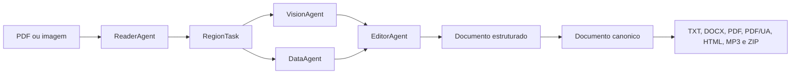
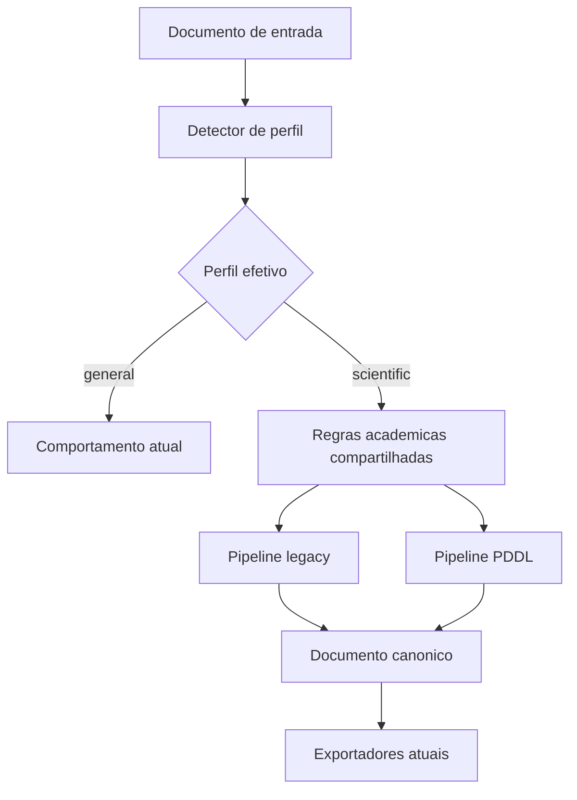
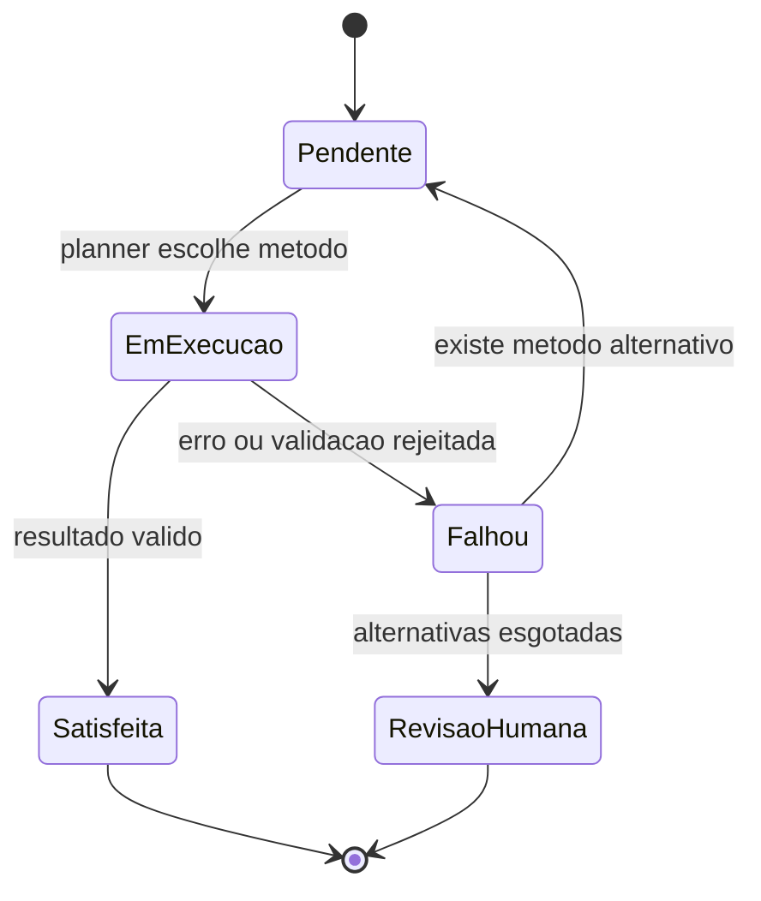

# Plano Tecnico: Leitura Acessivel de Artigos Cientificos

## 1. Objetivo

Esta task tem dois objetivos relacionados, mas diferentes:

1. melhorar a leitura acessivel de artigos cientificos em PDF, preservando a
   experiencia e os formatos de saida que o Acessilia ja oferece;
2. comparar, de forma reproduzivel, a arquitetura principal anterior
   (`legacy`) com a arquitetura baseada em manifesto, planejamento PDDL e
   execucao (`pddl`).

O resultado para o usuario continua sendo o documento acessivel nos formatos
atuais: TXT, DOCX, PDF, PDF/UA, HTML, MP3 e ZIP. A task nao cria um produto
separado para papers e nao cria um terceiro pipeline. Ela especializa os dois
pipelines existentes para que reconhecam e preservem informacoes proprias de
publicacoes cientificas.

O sucesso da feature nao sera medido apenas por "o PDF foi convertido". Um
artigo cientifico acessivel precisa permitir que uma pessoa encontre e entenda:

- titulo, autores, resumo e secoes;
- a ordem correta de leitura em paginas com duas ou mais colunas;
- figuras, graficos e diagramas, junto de suas legendas e do contexto em que
  sao citados;
- tabelas, seus cabecalhos, unidades, notas e significado estrutural;
- formulas, sua notacao original e uma alternativa textual compreensivel;
- citacoes no corpo do texto e suas referencias bibliograficas;
- notas, apendices e outros elementos que nao pertencem ao texto principal.

## 2. Por que artigos cientificos exigem tratamento proprio

Um PDF comum pode ser razoavelmente convertido extraindo blocos de texto e
imagens em ordem. Papers apresentam desafios adicionais:

### 2.1 Layout em colunas

Muitos artigos usam duas colunas. Uma extracao incorreta pode ler o inicio da
coluna esquerda, saltar para a direita e depois retornar ao fim da esquerda.
O texto resultante ainda contem quase todas as palavras, mas o argumento fica
sem sentido. Por isso, comprimento do texto nao e uma metrica suficiente.

### 2.2 Figura, legenda e contexto formam uma unidade

Uma figura cientifica raramente pode ser descrita olhando apenas seus pixels.
A legenda explica o experimento, o paragrafo anterior apresenta a pergunta e o
paragrafo posterior interpreta o resultado. O agente de visao precisa receber
esse contexto, mas deve separar claramente:

- o que e diretamente observavel na imagem;
- o que esta declarado na legenda;
- o que e interpretacao dos autores;
- o que nao pode ser lido com seguranca.

Essa separacao reduz alucinacoes, especialmente em graficos com valores pequenos,
heatmaps, imagens de microscopia e diagramas tecnicos.

### 2.3 Tabelas nao sao apenas texto em linhas

Uma tabela cientifica pode ter cabecalhos agrupados, unidades, notas de rodape,
celulas mescladas e destaques tipograficos. Uma linearizacao acessivel precisa
preservar a relacao entre cada valor e seus cabecalhos. Apenas concatenar as
celulas produz uma saida dificil de navegar e pode alterar o significado.

### 2.4 Formulas possuem duas necessidades

O sistema deve preservar a expressao original, preferencialmente em LaTeX ou
MathML valido, e oferecer uma verbalizacao. A verbalizacao nao substitui a
formula: ela e uma alternativa de leitura. Por exemplo, a estrutura de uma
fracao, os indices e o dominio das variaveis precisam continuar disponiveis.

### 2.5 Citacoes dependem de ligacoes

Marcadores como `[12]`, `(Silva et al., 2024)` ou sobrescritos precisam apontar
para a entrada bibliografica correta. Acessibilidade aqui significa preservar a
navegacao e o contexto, nao apenas copiar a secao de referencias para o fim.

## 3. Estado atual do repositorio

O Acessilia possui dois caminhos de processamento selecionados por
`PIPELINE_ENGINE`.

### 3.1 Arquitetura principal anterior (`legacy`)

O fluxo e coordenado por `AccessibilityOrchestrator`:



Responsabilidades atuais:

| Componente | Responsabilidade |
|---|---|
| `ReaderAgent` | separa paginas, extrai regioes e classifica seu conteudo |
| `VisionAgent` | descreve imagens e regioes visuais com modelo multimodal |
| `DataAgent` | processa tabelas, formulas e regioes orientadas a dados |
| `EditorAgent` | consolida os resultados e reduz duplicacoes |
| `build_canonical_document()` | converte o payload para o contrato comum de exportacao |

Esse fluxo ja realiza o trabalho real. Sua limitacao para papers e que cada
regiao e tratada principalmente no contexto da pagina. As relacoes academicas
entre elementos ainda nao sao representadas de forma consistente.

### 3.2 Arquitetura PDDL

O fluxo novo e coordenado por `PddlAccessibilityOrchestrator`:


O manifesto registra elementos, observacoes, obrigacoes, metodos admissiveis,
custos e tentativas. O planner escolhe uma sequencia valida de metodos e o
executor deveria aplicar cada metodo, validar seu efeito e atualizar o estado.

Entretanto, o caminho de servico ainda possui duas limitacoes importantes:

1. o orquestrador enriquece imagens e tabelas antes do planejamento;
2. o `MethodRegistry` usado pelo orquestrador registra handlers padrao que
   retornam sucesso sem executar a transformacao real.

Em outras palavras, o planejamento ja e auditavel, mas ainda nao controla todo
o trabalho que produz o documento. Isso e aceitavel para validar o PMV da
arquitetura, mas nao e suficiente para afirmar que o PDDL produz papers mais
acessiveis. A task deve corrigir essa lacuna antes da comparacao final.

### 3.3 Documento canonico e exportadores

Os dois pipelines convergem em `build_canonical_document()`. Essa e uma
vantagem importante: a comparacao pode avaliar documentos com o mesmo schema e
os mesmos exportadores, reduzindo variaveis externas.

O documento canonico deve continuar sendo a fonte de verdade dos formatos de
saida. Nao vamos implementar um exportador cientifico paralelo. As melhorias
necessarias em figuras, tabelas, matematica e referencias devem beneficiar os
formatos existentes.

## 4. Principio central do desenho

O conhecimento sobre o que caracteriza um paper nao deve pertencer apenas ao
pipeline legacy nem apenas ao PDDL. Ele sera implementado como uma camada de
dominio compartilhada.



Isso evita tres problemas:

- duplicar regras de deteccao e relacionamento nos dois orquestradores;
- criar um `ScientificPaperAgent` grande que repetiria leitura, visao, dados e
  edicao;
- tornar a comparacao injusta porque cada engine recebeu requisitos diferentes.

Os pipelines continuarao diferentes no modo como decidem e executam tarefas.
Eles compartilharao apenas o significado dos elementos e os criterios que um
resultado deve cumprir.

## 5. Perfil do documento

### 5.1 Valores publicos

O novo parametro sera chamado `document_profile` e aceitara:

| Valor | Comportamento |
|---|---|
| `auto` | detecta se o documento e cientifico; sera o padrao |
| `scientific` | forca o tratamento especializado |
| `general` | desativa o tratamento especializado |

O valor sera aceito pela API, pelo cliente HTTP, pelo painel web e pela CLI.
Telegram usara `auto` inicialmente para nao adicionar uma etapa ao envio
normal.

### 5.2 Por que permitir override

Deteccao automatica nunca sera perfeita. Uma tese, um relatorio tecnico e um
artigo podem compartilhar secoes como "Introducao" e "Conclusao". Tambem
existem papers sem estrutura convencional. O override permite corrigir falsos
positivos e falsos negativos sem mudar o arquivo.

### 5.3 Evidencias de deteccao

O detector sera deterministico e registrara as evidencias usadas, por exemplo:

- metadados de titulo e autoria;
- ocorrencia de `abstract`, `resumo`, `keywords` ou `palavras-chave`;
- conjunto e ordem de secoes como introducao, metodos, resultados e conclusao;
- secao de referencias e densidade de marcadores de citacao;
- captions numeradas de figuras e tabelas;
- formulas ou numeracao de equacoes;
- padrao de layout em colunas.

Nao sera usada uma regra fragil como "encontrou tres headings, logo e paper".
As evidencias terao pesos e grupos diferentes. O resultado deve conter a
classificacao, a confianca, a origem da decisao e as evidencias observadas.

Exemplo conceitual:

```json
{
  "requested_profile": "auto",
  "effective_profile": "scientific",
  "decision_source": "detector",
  "confidence": 0.91,
  "evidence": [
    "abstract-heading",
    "numbered-figures",
    "reference-section",
    "citation-density"
  ]
}
```

Esse perfil entrara nos metadados canonicos, no historico tecnico e na chave de
cache. Sem isso, uma execucao `general` poderia ser devolvida incorretamente
para uma solicitacao posterior forcada como `scientific`.

## 6. Modelo de informacao cientifica

Nao e necessario criar dezenas de novos tipos de bloco. O schema atual ja
possui headings, paragrafos, imagens, tabelas e matematica. O que falta sao
relacoes e metadados consistentes.

### 6.1 Metadados do artigo

Quando disponiveis, serao preservados:

- titulo;
- autores e afiliacoes;
- abstract/resumo;
- palavras-chave;
- DOI, identificador arXiv e dados de publicacao;
- idioma detectado;
- secoes e subsecoes.

Ausencia de um campo nao sera preenchida por inferencia do modelo. Metadados
desconhecidos permanecerao ausentes.

### 6.2 Relacao entre figura e legenda

Cada figura podera registrar:

- identificador da legenda;
- numero ou rotulo da figura;
- pagina e bounding box;
- secao em que aparece;
- paragrafos que citam a figura;
- texto alternativo produzido;
- metodo e confianca da descricao;
- necessidade de revisao humana.

A associacao sera feita primeiro por estrutura e proximidade espacial. Regex
sera usada apenas para reconhecer rotulos, como `Figure 2` ou `Figura 3`, e nao
para reconstruir o documento inteiro.

### 6.3 Graficos e diagramas

O prompt cientifico pedira uma resposta estruturada conceitualmente em:

1. tipo da visualizacao;
2. eixos, unidades, series e legenda, quando legiveis;
3. tendencia ou relacao diretamente observavel;
4. valores relevantes apenas quando legiveis;
5. informacao fornecida pela caption;
6. limitacoes da leitura visual.

Uma descricao nao deve afirmar causalidade apenas porque duas curvas variam
juntas. Tambem nao deve estimar numeros exatos a partir de pixels sem indicar
que se trata de aproximacao.

### 6.4 Tabelas

A representacao intermediaria continuara usando o `table_ast`, expandido ou
normalizado para preservar:

- caption;
- linhas de cabecalho;
- cabecalhos de linha;
- agrupamentos e `rowspan`/`colspan` quando conhecidos;
- unidades;
- notas e marcadores;
- celulas ausentes ou ilegíveis.

No TXT e no audio, a tabela pode ser linearizada por registro. No HTML, DOCX e
PDF/UA, a estrutura tabular deve ser mantida sempre que o exportador suportar.

### 6.5 Formulas

Uma formula podera manter:

- LaTeX ou outra origem reconhecida;
- numero da equacao;
- contexto textual anterior e posterior;
- variaveis explicadas no texto;
- verbalizacao em portugues;
- metodo usado e aviso de confianca.

O sistema nao colocara uma string LaTeX escapada dentro de uma tag `<math>` e a
chamara de MathML. O caminho Pandoc pode converter matematica para MathML real.
O renderer HTML de fallback devera expor a expressao e a verbalizacao com
semantica acessivel, mesmo sem MathML.

### 6.6 Citacoes e referencias

O primeiro incremento nao pretende substituir um gerenciador bibliografico.
Ele preservara:

- texto da entrada bibliografica;
- rotulo ou chave reconhecida;
- chamadas no corpo do artigo;
- ligacao entre chamada e referencia quando houver evidencia suficiente;
- DOI ou URL ja presentes no documento.

Nao faz parte desta task consultar Crossref para completar ou corrigir todas as
referencias. Essa pode ser uma evolucao posterior.

## 7. Integracao no pipeline legacy

O legacy continuara com os quatro agentes atuais.

### 7.1 Antes do processamento

O servico resolve o perfil solicitado. Se estiver em `auto`, executa o detector.
O resultado acompanha o job e nao e recalculado de maneira divergente a cada
pagina.

### 7.2 Durante a leitura

O `ReaderAgent` continua extraindo `RegionTask`, mas as tarefas cientificas
recebem contexto adicional:

- secao atual;
- caption associada;
- paragrafo que referencia o elemento;
- rotulo de figura, tabela ou equacao;
- tipo visual mais especifico quando detectavel.

### 7.3 Durante o dispatch

O `VisionAgent` continua responsavel por imagens. O `DataAgent` continua
responsavel por tabelas e formulas. A diferenca e que recebem instrucoes e
contexto cientifico, em vez de analisar recortes isolados.

As tarefas independentes continuam sendo executadas em paralelo com `asyncio`.
Nao ha motivo para trocar esse mecanismo por PDDL dentro do legacy.

### 7.4 Consolidacao

O `EditorAgent` deve preservar os identificadores e relacionamentos ao
consolidar a pagina. A conversao para o documento canonico usa esses metadados
para gerar figuras, captions, tabelas, matematica e referencias consistentes.

Para documentos `general`, o comportamento deve permanecer equivalente ao
atual. Essa regressao e um criterio de aceite, nao apenas uma expectativa.

## 8. Integracao no pipeline PDDL

O PDDL deve controlar as operacoes que alteram o estado de acessibilidade.

### 8.1 Manifesto

O extrator produz elementos e o enriquecedor cientifico identifica relacoes.
O builder deriva observacoes e obrigacoes como:

| Obrigacao | Exemplo de criterio de conclusao |
|---|---|
| `repair-reading-order` | headings e paragrafos seguem ordem coerente |
| `link-figure-caption` | figura aponta para uma caption valida |
| `describe-scientific-figure` | descricao validada e associada ao elemento |
| `linearize-table` | cabecalhos e linhas podem ser percorridos |
| `verbalize-formula` | origem preservada e alternativa textual presente |
| `link-citation-reference` | chamada aponta para referencia reconhecida |
| `review-structure` | ambiguidade foi resolvida ou marcada para revisao |

Nem toda relacao precisa virar um novo `ElementType`. Obrigacoes podem atuar
sobre elementos existentes e registrar seus efeitos em `metadata`.

### 8.2 Planejamento

O planner recebe:

- obrigacoes selecionadas;
- dependencias entre elas;
- metodos admissiveis;
- tentativas anteriores;
- custos nominais;
- estado atual do manifesto.

Exemplo: descrever uma figura pode depender de ligar sua caption primeiro.
Linearizar uma tabela pode tentar a estrutura do Docling antes de recorrer a
OCR visual ou revisao humana.

O custo PDDL e uma unidade de preferencia do dominio, nao valor monetario. Um
metodo com custo 10 e preferido a um com custo 20, mas isso nao significa dez
reais ou dez tokens.

### 8.3 Handlers reais

Cada metodo escolhido deve possuir um handler que:

1. localiza a obrigacao e seus elementos-alvo;
2. verifica precondicoes;
3. executa a ferramenta ou transformacao;
4. valida o resultado;
5. atualiza o manifesto apenas se a validacao passar;
6. registra tentativa, duracao e artefatos;
7. retorna falha quando nao consegue cumprir o criterio.

Handlers prioritarios:

- `vision-description`;
- `docling-table`;
- `pandoc-table`;
- `mathml` ou conversao matematica equivalente;
- `latex-verbalizer`;
- reparos deterministicos de heading, caption e referencia.

`human-review` nao pode ser um handler automatico que retorna sucesso. Ele deve
deixar a obrigacao pendente e produzir um aviso claro de revisao.

### 8.4 Replanejamento

Quando um metodo falha, sua tentativa e registrada. Uma nova compilacao pode
selecionar outro metodo admissivel ainda nao tentado. O primeiro incremento
pode limitar a quantidade de replanejamentos para evitar loops.



### 8.5 Saida PDDL

O documento canonico sera construido a partir do manifesto depois da execucao,
nao de um estado anterior ao plano. Metadados tecnicos devem incluir:

- custo nominal esperado e observado;
- obrigacoes satisfeitas, falhas e pendentes;
- metodos executados;
- quantidade de replanejamentos;
- avisos de revisao humana;
- relatorio de execucao.

## 9. Ferramentas externas avaliadas

### 9.1 Docling: adotar e aprofundar

Docling ja e dependencia opcional do projeto e possui licenca MIT. Ele cobre
layout, ordem de leitura, tabelas, formulas, OCR e uma representacao estruturada
com proveniencia. E o melhor ponto de partida porque nao adiciona uma nova
infraestrutura e serve aos dois pipelines.

A implementacao deve respeitar a versao efetivamente travada no `poetry.lock`.
APIs recentes vistas na documentacao publica nao podem ser assumidas sem teste
contra essa versao.

### 9.2 ar5iv/LaTeXML: usar como referencia

ar5iv converte fontes LaTeX do arXiv em HTML5 e MathML. Ele e util para entender
a estrutura esperada e auxiliar a anotacao do corpus. Nao sera entrada do
benchmark, pois isso eliminaria justamente o desafio de processar o PDF.

### 9.3 GROBID: nao incluir neste incremento

GROBID e forte em metadados, citacoes e TEI XML, mas adicionaria um servico Java,
modelos e operacao separada. Pode ser avaliado depois como adapter opcional,
especialmente se a ligacao bibliografica local nao atingir qualidade suficiente.

### 9.4 Nougat: usar como referencia, nao como dependencia

O codigo e MIT, mas os pesos oficiais sao CC-BY-NC e o projeto tem atividade
menor que Docling. Isso cria restricao para uso comercial e custo operacional
adicional. O paper do Nougat continua sendo um bom caso de teste.

### 9.5 pdffigures2: nao incluir neste incremento

A ferramenta extrai figuras e captions, mas exige stack Scala/Java, tem foco
forte em papers de computacao e menor atividade recente. Docling ja cobre a
necessidade inicial com menor complexidade de integracao.

## 10. Corpus de cinco papers

Os PDFs nao serao commitados. Um manifesto versionado registrara URL exata,
versao, licenca declarada, SHA-256, tamanho e desafios esperados. Um script fara
o download e recusara arquivos cujo hash nao corresponda.

| ID fixado | Papel no corpus | Licenca declarada no arXiv |
|---|---|---|
| `2408.09869v5` | Docling: colunas, tabelas, diagramas e graficos | CC BY 4.0 |
| `2308.13418v1` | Nougat: 17 paginas, 10 figuras, formulas e tabelas | CC BY-SA 4.0 |
| `1911.02782v3` | S2ORC: metadados, citacoes e bibliografia | CC BY 4.0 |
| `1706.03762v7` | Attention: formulas, tabelas e heatmaps | arXiv non-exclusive |
| `1906.11241v1` | EHT M87: imagens astronomicas e reconstrucoes | arXiv non-exclusive |

Estar disponivel no arXiv nao significa possuir licenca Creative Commons. O
manifesto preservara a licenca exibida em cada pagina, sem inferencias.

### 10.1 Por que esses papers

Os tres primeiros exercitam documentos e metadados de computacao, onde as
ferramentas de parsing costumam ter melhor desempenho. Attention adiciona
notacao matematica e heatmaps conhecidos. O EHT evita que o corpus fique
restrito a IA e introduz imagens cientificas cujo significado depende fortemente
de caption e contexto.

### 10.2 Anotacoes de referencia

Para cada paper, sera criada uma anotacao pequena e verificavel, nao uma
transcricao integral. Ela contera:

- titulo, abstract e headings esperados;
- ordem de leitura de paginas criticas;
- amostra de figuras e captions;
- amostra de tabelas e seus cabecalhos;
- formulas selecionadas;
- chamadas e entradas bibliograficas selecionadas;
- elementos deliberadamente ambiguos.

As anotacoes devem ser revisadas olhando o PDF. HTML do arXiv ou ar5iv pode
ajudar, mas nao sera tratado como verdade absoluta porque a conversao tambem
pode conter erros.

## 11. Como comparar legacy e PDDL

O script atual mede duracao, secoes, blocos e tamanho do texto. Essas medidas
sao uteis para diagnostico, mas nao demonstram acessibilidade. A nova comparacao
tera quatro dimensoes.

### 11.1 Qualidade estrutural automatica

Metricas propostas:

| Dimensao | Medida |
|---|---|
| deteccao | perfil correto para casos positivos e negativos |
| secoes | precision/recall de headings e acuracia da ordem |
| conteudo | cobertura dos trechos anotados sem duplicacao excessiva |
| figuras | pares figura-caption e cobertura de texto alternativo |
| graficos | presenca de tipo, eixos, unidades, series e tendencia quando aplicavel |
| tabelas | caption, cabecalhos, dimensoes e associacao celula-cabecalho |
| formulas | preservacao da origem, numero e verbalizacao |
| referencias | entradas preservadas e chamadas ligadas corretamente |
| contrato | documento canonico e exports validos |
| PDDL | obrigacoes satisfeitas, falhas, metodos e replanejamentos |

BLEU ou similar nao sera usado como metrica principal de alt text. Uma figura
pode ter varias descricoes corretas com vocabularios diferentes. A avaliacao
deve verificar componentes factuais e utilidade.

### 11.2 Desempenho operacional

Para cada engine e paper, registrar:

- tempo total e tempo por etapa;
- uso de cache;
- quantidade de chamadas por agente/ferramenta;
- retries e falhas;
- tokens de entrada e saida, quando o provedor informar;
- tamanho dos artefatos;
- memoria, se a instrumentacao for confiavel no ambiente.

Cada caso tera execucao fria e, quando relevante, quente. O cache deve ser
isolado entre engines para que uma arquitetura nao reaproveite o trabalho da
outra acidentalmente.

### 11.3 Custo

Existem dois custos diferentes:

1. **custo nominal PDDL:** unidade abstrata usada pelo planner para escolher
   metodos;
2. **custo operacional:** chamadas, tokens, duracao e eventualmente valor em
   moeda.

Eles serao reportados separadamente. O custo monetario so sera calculado quando
o modelo e sua tabela de precos estiverem configurados. Nao vamos converter
automaticamente custo PDDL em reais ou dolares.

### 11.4 Avaliacao humana cega

Os documentos serao anonimizados como resultado A e B, sem indicar o engine.
A rubrica avaliara de 1 a 5:

- fidelidade ao paper;
- completude;
- navegacao e ordem de leitura;
- utilidade das descricoes visuais;
- clareza das tabelas;
- utilidade das formulas verbalizadas;
- navegacao entre citacoes e referencias;
- carga cognitiva e presenca de ruido.

Idealmente, dois avaliadores revisarao os mesmos elementos e registrarao uma
justificativa curta. A concordancia entre avaliadores sera publicada junto das
notas. A amostra de cinco papers e exploratoria; o relatorio nao deve apresentar
significancia estatistica que o desenho nao suporta.

## 12. Protocolo reproduzivel

Para evitar favorecer uma arquitetura, o benchmark deve:

1. usar os mesmos bytes de entrada;
2. usar o mesmo perfil `scientific`;
3. fixar modelo, provedor, modo, extrator e configuracoes;
4. registrar versoes das dependencias e do sistema;
5. isolar ou desativar caches;
6. executar as duas arquiteturas sob as mesmas condicoes;
7. repetir cada combinacao pelo menos tres vezes;
8. preservar documento estruturado, canonico, exports e logs de metricas;
9. validar os artefatos antes de calcular o agregado;
10. marcar como inconclusivo qualquer caso em que um engine falhe.

A comparacao principal usara o planner interno, que e deterministico e nao
adiciona a variavel de um binario externo. A comparacao entre planner interno e
Fast Downward sera um experimento secundario. Assim nao confundimos duas
perguntas:

- legacy ou PDDL produz melhor documento?
- qual backend de planejamento produz melhor plano PDDL?

## 13. Fases de implementacao

### Fase 1: perfil e deteccao

Entregas:

- contrato `DocumentProfile`;
- detector deterministico;
- parametro `document_profile` na API, web e CLI;
- propagacao pelo job e pelo servico;
- cache separado por perfil;
- testes positivos e negativos.

Saida observavel: o documento canonico informa se foi tratado como cientifico e
por que.

### Fase 2: estrutura cientifica compartilhada

Entregas:

- relacionamento de captions, figuras, tabelas e secoes;
- contexto de formulas;
- reconhecimento de citacoes e referencias;
- prompts cientificos;
- normalizacao de tabelas e matematica;
- melhorias no documento canonico e renderers.

Saida observavel: um payload sintetico produz HTML, TXT e DOCX com estrutura
cientifica preservada, independentemente do engine.

### Fase 3: integracao legacy

Entregas:

- contexto cientifico em `RegionTask`;
- dispatch especializado sem novos agentes redundantes;
- consolidacao que preserva IDs e relacoes;
- regressao para documentos gerais.

Saida observavel: ao menos uma fixture sintetica percorre o legacy e produz
figura com caption, tabela e formula acessiveis.

### Fase 4: execucao PDDL real

Entregas:

- obrigacoes cientificas;
- custos e metodos admissiveis;
- handlers reais;
- efeitos aplicados depois de validacao;
- fallback e replanejamento limitado;
- payload construido do manifesto apos a execucao;
- schemas regenerados, se o contrato mudar.

Saida observavel: falhar um handler nao satisfaz a obrigacao; um metodo
alternativo pode ser planejado; o documento final reflete apenas efeitos
confirmados.

### Fase 5: corpus e gold set

Entregas:

- manifesto dos cinco papers;
- downloader com verificacao de SHA-256;
- anotacoes de referencia;
- documentacao de licencas;
- marker de pytest para integracao externa.

Saida observavel: outra pessoa consegue baixar exatamente os mesmos arquivos e
validar seus hashes.

### Fase 6: benchmark

Entregas:

- execucao por corpus ou arquivo;
- metricas de qualidade, tempo e custo;
- relatorios JSON, Markdown e CSV;
- artefatos separados por paper, engine e repeticao;
- rubrica de avaliacao humana.

Saida observavel: o relatorio explica diferencas por categoria, e nao apenas um
placar geral.

### Fase 7: hardening e documentacao

Entregas:

- suite completa sem regressao;
- validacao de schemas;
- inspecao dos formatos de saida;
- guia de uso e reproducao;
- limitacoes conhecidas.

## 14. Estrutura de arquivos proposta

```text
backend/
  pipeline/
    scientific/
      __init__.py
      models.py
      detector.py
      enricher.py
      figures.py
      formulas.py
      references.py
  core/
    execution/
      scientific_handlers.py
benchmarks/
  scientific_papers/
    corpus.json
    review_rubric.md
    annotations/
scripts/
  download_scientific_corpus.py
  benchmark_pipelines.py
tests/
  test_scientific_detector.py
  test_scientific_enrichment.py
  test_scientific_handlers.py
```

Os nomes podem ser ajustados durante a implementacao para seguir melhor as
abstracoes existentes. O ponto importante e manter regras de dominio fora dos
orquestradores e handlers PDDL fora do executor generico.

## 15. Estrategia de testes

### 15.1 Testes unitarios

Fixtures pequenas e sinteticas cobrirao:

- deteccao e override;
- casos gerais que nao podem ser classificados como papers;
- associacao figura-caption;
- headings e ordem de leitura;
- tabelas com cabecalhos agrupados;
- formulas com e sem origem LaTeX;
- referencias numericas e autor-data;
- cache por perfil;
- validacao dos efeitos dos handlers.

Esses testes nao devem chamar modelos remotos.

### 15.2 Testes de integracao

Cobertura dos fluxos completos:

- legacy para documento canonico;
- PDDL com handler bem-sucedido;
- PDDL com falha e metodo alternativo;
- API e cliente propagando o perfil;
- outputs TXT, DOCX, HTML, PDF e PDF/UA;
- corpus real, sob marker explicito.

### 15.3 Validacao manual

Os formatos HTML, DOCX e PDF/UA devem ser inspecionados com leitor de tela. Se
disponiveis, validadores como veraPDF e checkers HTML complementam a inspecao,
mas nao a substituem. Passar em um checker nao garante que a descricao de um
grafico seja util.

## 16. Riscos e mitigacoes

| Risco | Impacto | Mitigacao |
|---|---|---|
| detector classifica relatorios como papers | processamento desnecessario | confianca, evidencias e override `general` |
| ordem de colunas incorreta | argumento fica incoerente | gold set por pagina e metrica de ordem |
| descricao visual inventa valores | informacao cientifica falsa | contexto, prompt restritivo, validacao e revisao |
| tabela perde cabecalhos | valores ficam ambiguos | `table_ast`, validacao estrutural e fallback |
| verbalizacao altera formula | erro conceitual | preservar origem e marcar confianca |
| PDDL confirma handler noop | comparacao invalida | remover sucesso automatico e testar efeitos |
| replanejamento entra em loop | job nao termina | limite de tentativas e metodos ja tentados |
| benchmark favorece cache/modelo | conclusao enviesada | ambiente fixado e cache isolado |
| APIs do Docling mudam | quebra de integracao | testar contra lock e encapsular adapter |
| custo monetario e inferido errado | relatorio enganoso | publicar apenas quando precos estiverem configurados |
| licenca de paper e presumida | risco juridico | registrar a licenca oficial por versao |

## 17. Criterios de aceite

A feature estara pronta para comparacao quando:

1. `auto`, `scientific` e `general` funcionarem da API ate o documento final;
2. documentos gerais mantiverem o comportamento anterior;
3. figuras cientificas receberem caption e contexto antes da descricao;
4. tabelas preservarem cabecalhos e captions nos formatos suportados;
5. formulas preservarem a origem e possuirem alternativa textual quando
   processadas;
6. citacoes e referencias selecionadas no gold set forem preservadas;
7. o PDDL executar handlers reais e nao satisfizer obrigacoes em falhas;
8. os dois engines produzirem o mesmo schema canonico e usarem os mesmos
   exportadores;
9. o corpus puder ser reproduzido por URL, versao e SHA-256;
10. o benchmark publicar qualidade, tempo e custo sem misturar suas unidades;
11. a avaliacao humana for cega em relacao ao engine;
12. a suite automatizada completa passar.

## 18. O que nao faz parte desta task

Para proteger o escopo, ficam de fora:

- treinar ou fazer fine-tuning de modelos;
- criar um novo frontend dedicado a papers;
- adicionar novos formatos como JATS ou BibTeX;
- certificar formalmente conformidade WCAG ou PDF/UA;
- corrigir referencias consultando bases externas;
- traduzir integralmente o artigo;
- garantir qualidade para todos os PDFs escaneados historicos;
- instalar GROBID, Nougat ou pdffigures2 como dependencias obrigatorias;
- declarar superioridade estatistica com apenas cinco papers.

Esses itens podem virar tasks posteriores depois que o benchmark mostrar onde
estao os maiores ganhos e gargalos.

## 19. Resultado esperado

Ao final, o Acessilia tera uma feature de leitura cientifica integrada ao
produto existente e um experimento que permite responder perguntas concretas:

- qual arquitetura preserva melhor a estrutura do paper?
- qual produz descricoes visuais mais uteis e fieis?
- qual trata melhor tabelas, formulas e referencias?
- quanto tempo, quantas chamadas e quantos tokens cada uma consome?
- o planejamento PDDL escolhe fallbacks uteis quando uma ferramenta falha?
- em quais categorias o PDDL agrega valor e em quais o legacy continua mais
  simples ou eficiente?

O objetivo da comparacao nao e provar antecipadamente que o PDDL e melhor. E
criar as condicoes para que a resposta venha dos artefatos produzidos, das
metricas e da experiencia real de leitura.

## 20. Estado da implementacao nesta branch

Esta branch entrega a primeira versao executavel da especializacao cientifica
e do benchmark. O estado abaixo distingue codigo implementado de resultados que
ainda dependem de uma execucao com modelos e credenciais configurados.

### 20.1 Entregue

- contrato de perfil `auto`, `scientific` e `general`;
- detector deterministico com confianca e evidencias;
- propagacao do perfil pela API, cliente, worker, servico e painel avancado;
- chave de cache sensivel ao perfil efetivo;
- enriquecimento compartilhado de secoes, figuras, captions, tabelas e
  obrigacoes cientificas;
- contexto de caption e secao para o agente de visao nos dois engines;
- handlers PDDL deterministicos para captions, tabelas, formulas e codigo;
- falha explicita de `human-review`, sem satisfacao automatica falsa;
- execucao PDDL nao simulada no benchmark;
- avaliador automatico auditavel nas dimensoes titulo, headings, conteudo,
  figuras, tabelas, formulas, referencias e contrato canonico;
- corpus fixado de cinco papers, com versao, licenca declarada, tamanho e
  SHA-256;
- downloader que valida assinatura PDF, tamanho e hash;
- anotacoes de referencia por paper e rubrica de avaliacao humana cega;
- agregador de execucoes pareadas com qualidade media, desvio, tempo, taxa de
  sucesso, delta PDDL menos legacy e veredito inconclusivo em falhas.

### 20.2 Como reproduzir

Baixar ou verificar os cinco PDFs sem versiona-los no Git:

```bash
python scripts/download_scientific_corpus.py
```

Executar tres repeticoes por paper e por engine:

```bash
python scripts/benchmark_scientific_corpus.py \
  --repetitions 3 \
  --pddl-extractor-backend docling \
  --export-formats txt
```

O relatorio agregado e gravado por padrao em:

```text
var/data/scientific-benchmark-results/scientific_benchmark_report.json
```

Para avaliar um unico PDF com sua anotacao de referencia:

```bash
python scripts/benchmark_pipelines.py artigo.pdf \
  --annotations benchmarks/scientific_papers/annotations/2408.09869v5.json
```

As execucoes devem registrar no relatorio o provedor, modelo, extrator, modo e
ambiente efetivamente usados. Sem credenciais para os agentes remotos, o corpus
e as metricas continuam reproduziveis, mas nao existe resultado comparativo de
producao que possa sustentar um vencedor.

### 20.3 Pendencias conhecidas

- mover toda a descricao visual assincrona para uma acao controlada pelo plano
  PDDL; atualmente parte do enriquecimento visual ainda ocorre antes do plano;
- aprofundar os renderers para MathML, navegacao bibliografica e estruturas
  tabulares complexas em todos os formatos;
- executar as 15 combinacoes do protocolo em ambiente fixado e publicar os
  artefatos e numeros resultantes;
- realizar a avaliacao humana cega com pelo menos dois revisores;
- medir tokens e custo monetario somente quando o provedor expuser uso e a
  tabela de precos estiver fixada;
- ampliar a suite de integracao dos formatos DOCX, HTML, PDF e PDF/UA para os
  casos cientificos reais.

Por essas pendencias, esta entrega deve ser descrita como infraestrutura de
benchmark e primeiro incremento funcional, nao como prova de superioridade de
uma das arquiteturas.